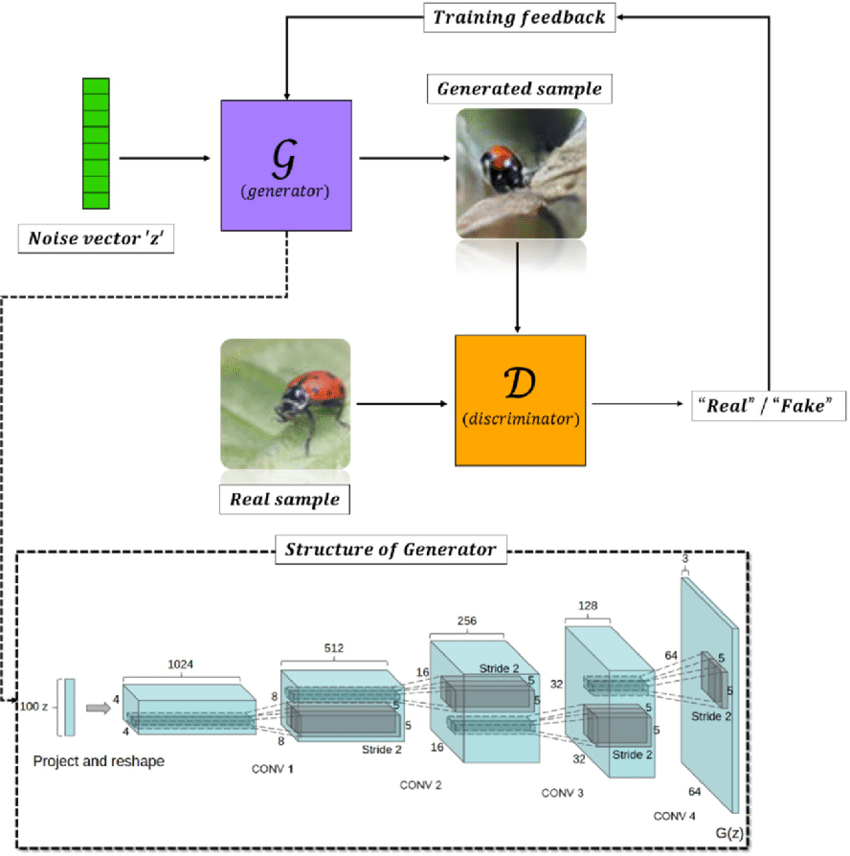

 

  

  <h3 align="center">DCGAN, ACGAN and Wasserstein GAN Implementation</h3>

  

    Neural Networks Course Assignment - Fall 2022 - University of Tehran

<!-- TABLE OF CONTENTS -->

  
Table of Contents

  <ol>
    <li>
      <a href="#about-the-project">About The Project</a>
    </li>
    <li>
      <a href="#built-with">Built With</a>
    </li>
    <li><a href="#useful-links">Useful Links</a></li>
    <li><a href="#contact">Contact</a></li>
  </ol>

<!-- ABOUT THE PROJECT -->
## About The Project

In this project, three different GANs were implemented. Various components of the GAN network, including the Generator, Discriminator, and loss functions, were built from scratch. Additionally, several techniques were employed to improve the training process and enhance GAN stability. These techniques included One-sided label smoothing, batch normalization, and the addition of noise. The dataset used for training is the Finger Digits 0-5 dataset, accessible via this <a href="https://www.kaggle.com/datasets/roshea6/finger-digits-05">link</a>.

## Built With

The programming language, frameworks, and technologies used in the project are listed here:

* Python
* Tensorflow

(<a href="#top">back to top</a>)

## Useful Links

Some useful links and tutorials about this project can be found here:

* [DCGAN](https://arxiv.org/pdf/1511.06434.pdf)
* [Conditional Image Synthesis with Auxiliary Classifier GANs](https://arxiv.org/pdf/1610.09585.pdf)
* [WGAN](https://arxiv.org/pdf/1701.07875.pdf)

(<a href="#top">back to top</a>)

<!-- CONTACT -->
## Contact

Mehrdad Nourbakhsh - mehrdad.nb4@gmail.com

(<a href="#top">back to top</a>)

